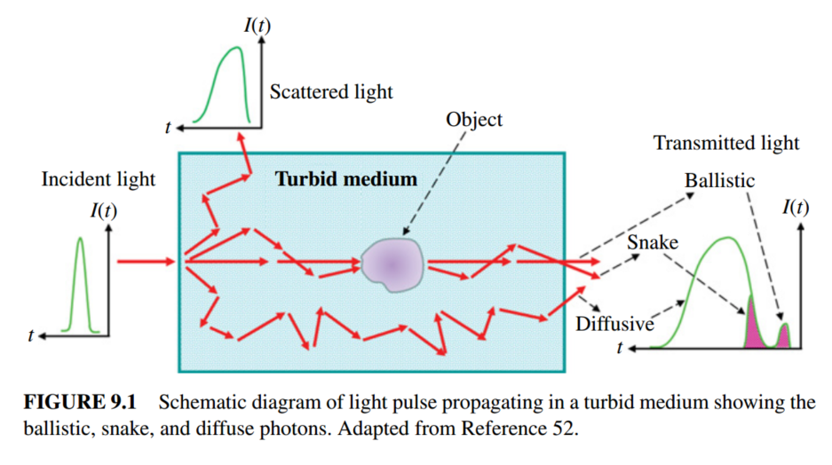

# LIGHT PROPAGATION IN HIGHLY SCATTERING TURBID MEDIA

## 参考:
	1. Photonics: Scientific Foundations, Technology and Applications, Biomedical Photonics, Spectroscopy, and Microscopy Volume IV 中的第九章. 

	作者: R. R. Alfano, W. B. Wang, L. Wang, and S. K. Gayen

	2. Biomedical Optics: Principles and Imaging, 生物医学光学: 原理和成像

	作者: 汪立宏, 吴新一

---

## 光的散射

散射(Scattering): 光束通过光学性质不均匀的介质时，光线向四面八方传播的现象。

光子倍分子散射的类型有两种, 弹性散射和非弹性散射(拉曼散射). 前者不涉及光子和分子之间的能量交换, 后者存在能量交换. 弹性散射和非弹性散射的特点之一在于散射后光的频率(波长)是否会发生变化. 弹性散射指光的频率发生散射后不会发生改变, 例如米氏散射和瑞利散射. 而非弹性散射指散射后光的频率发生了改变, 例如拉曼散射. 

**米式散射**米氏散射的强度与光波长的2次方成反比，且随着颗粒的增大，散射强度随波长变化的起伏变弱. 
**瑞利散射**: 瑞利散射是弹性散射的一种，通常需要满足的条件是微粒尺度远小于入射光波长，一般要小于波长的1/10，且各个方向的散射强度不一致，该强度与波长的4次方成反比。
**拉曼散射**: 发生瑞利散射时, 大部分散射光具备相同的波长. 极小一部分(大约1/10^9)散射光波长与入射光不同, 这部分散射为拉曼散射. 

拉曼散射可以揭示生物组织特定的化学成分和分子结构, 而弹性散射可以揭示散射体的尺寸分布. 

> 常见的可能还有布里渊散射, 其本质上也属于拉曼效应，是由于光在介质中受到激发后产生不同频率的散射光。

## 光子在生物组织种传输的基本原理

相比于传统的CT成像, 超声成像和MRI核磁共振成像, 光学成像具备较高的成像对比度和更好的空间分辨率, 在部分生物医学的功能性成像应用中也表现出更好的性能. 同时光学无损的特点也提供更安全的检测. 生物样本的光学信息会和其分子构象相关, 进而会通过吸收, 荧光, 拉曼散射等不同光学效应提供不同的生物化学信息. 这些是光学探测与成像运用在生物医疗领域的优势. 

而大多数生物样本对光的高散射和部分生物样本对光的高吸收特性导致了部分光学成像应用较低的成像深度. 在强散射介质中成像, 是目前的一个研究难点. 在文献中, 这样的样本(或者光的传播介质)一般被称为散射介质(scattering medium)或浑浊介质(turbid medium). 在400~1350nm光谱区域, 生物组织对光的吸收较弱. 光子散射事件之间的平均自由程为0.1mm量级. 而平均吸收长度(光子吸收前的平均路径长度)达到了10~100mm. 

生物样本中对光的衰减主要包括两个部分: **吸收和散射**. 

### 吸收
吸收系数μa定义为介质中每单位路径长度上光子吸收的概率，倒数称为“平均吸收长度”。
光在吸收介质中的传播衰减遵循公式：$dI/I=−μ_a dx$
积分得到光强分布函数$I(x)=I_0exp⁡(−μ_a x)$
生物中光的吸收主要来源于血红蛋白，黑色素和水

探测光和样本接触后，返回的光包括：弹道光（单散射光）和多散射光（噪音）
其中弹道光为仅和样本接触，未被散射的光。是成像中的有效信号来源。
多散射光按传播时间分为和弹道光有相同和不同的传播时间。其中传播时间不同的光均为噪声，可用time-gated filtering 方法去除。
而和弹道光有相同传播时间的多散射光，则分为接触样本和未接触样本的光。

### 散射

散射系数μs定义为介质中每单位路径长度上光子散射的概率，倒数称为“散射平均自由程”。
光在散射介质中的传播衰减遵循公式：$dI/I=−μ_s dx$
积分得到光强分布函数$I(x)=I_0  exp⁡(−μ_s x)$

消光系数$μ_t=μ_a+μ_s$

光在生物样本中的衰减主要分为吸收和散射，以平均吸收程定量描述吸收过程,表示光子在介质的吸收作用下所经过的平均距离,吸收系数定义为平均吸收程的倒数,即$β_ab=1/l_ab$;以散射平均自由程$l_sc$ 定量描述散射过程,表示光在介质中发生相邻两次散射事件所需要传播的平均距离,散射系数定义为散射平均自由程的倒数,即$β_sc=1/l_sc$。在实际的散射介质中,散射和吸收同时存在,以衰减系数(消光系数或传输系数)同时描述介质的散射和吸收作用,即衰减系数$β_t=β_ab+β_sc$,以衰减系数的倒数描述平均自由程$l_t=1/β_t。$

吸收系数=1/平均吸收长度

散射系数=1/散射平均自由程

解决散射介质中成像的关键在于解决**光散射**的问题, 根据波长的不同, 光被生物组织不同程度地散射和吸收, 产生漫散射光. 而漫散射光会导致成像模糊, 降低细节. 相对来说, 生物介质的吸收作用对成像的影响相对较小. 

### 偏振

偏振光可以线偏振光和园偏振光. 

线性双折射材料的两个主折射率与光(电场方向)的两个线性偏振状态有关. 光的偏振方向与样本的光轴方向平行的折射率用$n_e$表示, 称为非寻常光; 光的偏振方向与样本的光轴方向垂直的折射率用$n_o$表示, 称为寻常光. 寻常光与非寻常光的区别在于寻常光遵守折射定律. 

圆双折射材料具有与光的左旋和右旋圆偏振态相关的两个主折射率, 它可以旋转线偏振光. 旋转量取决于活性材料的性质和浓度, 光波长和光程. 若其他参数是已经确定的, 旋转量可以反映浓度信息. (这就是常见的偏振光测量某溶液浓度的原理). 

具有双折射性质的生物材料: 胶原蛋白, 肌纤维, 髓鞘, 视网膜, 角蛋白. 

### 荧光

荧光具备如下特点:
1. 荧光相对激发光有红移现象, 即出射的荧光波长会大于激发光. 
2. 红移频率的改变量独立于激发光的频率. 
3. 激发光可能是相干光, 但荧光一定不是相干光. 

基于以上特征, 生物成像中往往有应用广泛的荧光成像染料. 这种染料往往存在反映某种生物特性的光学特征. 将这种染料加入到生物样本中, 然后使用特定的波长对这个荧光染料分子进行成像. 成像的结果往往可以反映生物样本的功能, 结构或特征. 

生物中主要存在两个探测窗口, 最重要的一个是700-1100nm的窗口, 被称为**治疗窗口**. 生物组织中的关键发色团分子是血液、水、蛋白质和脂肪。从介质中射出的光与入射光具有不同的特性。另一个是1550~1560nm波段.

> 吸收是由组织中原子和分子能级内的电子和振动跃迁引起的. 散射是由组织的微观和宏观结构的折射率变化引起的; 当光的波长变得与散射元素的大小相当时, 散射就会强烈地增加. 除了光的吸收和散射外, 物体在吸收入射光后发出的荧光也可以为成像提供必要的对比度, 并由此衍生出了荧光成像方法.

## 生物样本中散射光的成分

从样本中出射的散射光脉冲光包括三个组成部分: 弹道光(ballistic), 蛇形光子(snake)和扩散光子(diffusive). 

1. 弹道光子(相干前向散射光子)沿入射光束的方向传播, 穿过最短的路径, 保留入射光的大部分特征, 并携带形成直接图像的最大信息. 

2. 多重散射光在介质中传播较长的距离, 丢失大部分图像信息. 轻微的前向散射光子保留了隐藏在散射介质中的重要的初始性质和结构信息。这些光子被称为蛇形光子，因为它们的轨迹类似于一条蠕动的蛇. 

3. 扩散光子在进入介质的最初就被散射大幅度偏离了原来的轨道, 导致其没有和成像样本有任何交互, 不携带任何有效信息. 

这三种成分在透射光束中的相对强度取决于光的颜色和样品的特性. 在高散射光学厚介质中, 弹道分量极其微弱, 而漫射分量最为强烈. 为了利用弹道光子和蛇形光子形成浑浊介质内部结构的图像, 需要对最大量的扩散光子进行强烈的区分. 

目前, 有两种对强散射厚介质成像的解决方法: 一, 从多重散射的图像中过滤出带有样本信息的光子. 二, 对所有光子进行检测, 利用光传播模型和复杂的计算机算法，从测量的强度、已知的实验参数和组织特征构建图像。

## 四个基本的光学参数: 
1. 吸收长度$l_{a}$
2. 散射平均自由程$l_{s}$
3. 传播平均自由程$l_{t}$
4. 各向异性因子$g$

